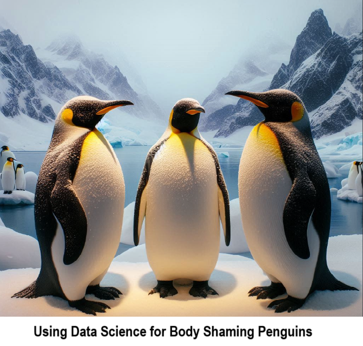
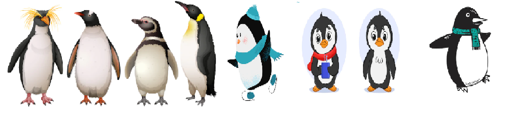
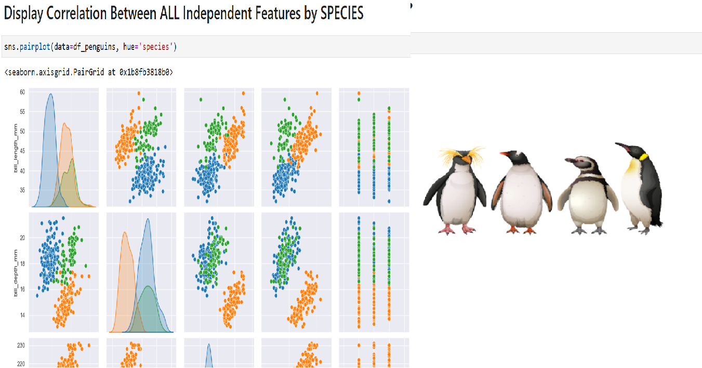
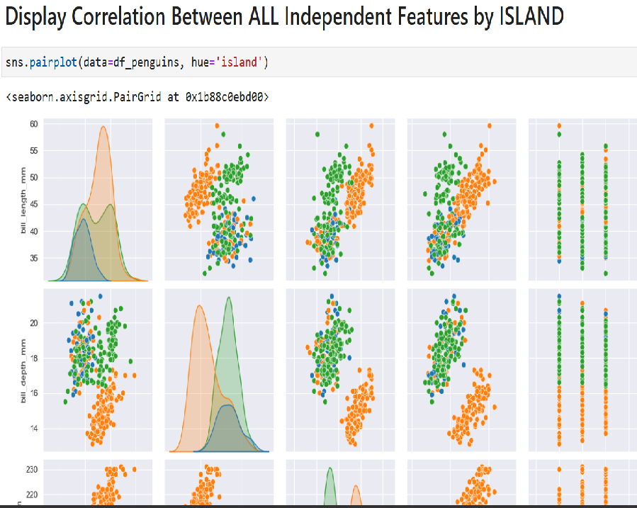
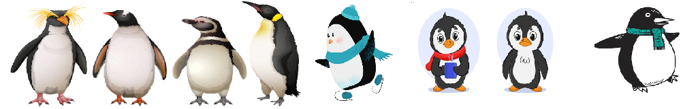

    
# Penguins 

## Solution for Penguins

    

Data science can be used to examine various species of penguins and the islands they inhabit by analyzing features such as species type, body measurements (e.g., flipper length, bill length, and body mass), island location, and other environmental factors (e.g., temperature, food availability). By collecting and analyzing this data, scientists can gain insights into the differences between penguin species, how they adapt to their environments, and their population distribution across different islands.

Independent features, such as body measurements or island locations, can be easily visualized using libraries like **Seaborn** in Python. Seaborn provides functions for creating scatter plots, box plots, histograms, and more, which can reveal patterns, correlations, and distributions. For example, a scatter plot can show the relationship between flipper length and body mass for different penguin species, while a bar chart can illustrate the number of penguins on each island. These visualizations make it easier to spot trends, such as how specific body traits may be linked to survival on particular islands.

This approach to data science is beneficial and innovative because it allows researchers to process and analyze large datasets quickly and efficiently. By visualizing and statistically analyzing the data, scientists can make data-driven conclusions about penguin behavior, adaptations, and even the effects of climate change on different species. This method can also help in conservation efforts by identifying vulnerable populations and assessing how environmental changes affect penguin habitats.

The `sns.pairplot(data=df_penguins, hue='species')` function from the Seaborn library is a powerful tool for quickly visualizing relationships and patterns within a dataset. Here's how it works and why it's beneficial:

### Explanation:
- **`sns.pairplot`** generates a grid of plots where each row and column represents a different numerical feature (independent variable) in the dataset.
- For each pair of features, it creates a scatter plot to show the relationship between them. For example, you might see how **flipper length** correlates with **bill length**.
- The **diagonal** of the grid contains histograms (or kernel density plots) for each feature, showing the distribution of values for that feature.
- The **`hue='species'`** parameter adds a color-coding scheme to differentiate between the categories (in this case, different penguin species). Each species gets its own color, making it easy to distinguish patterns and see how species differ across various measurements.

### Benefits:
1. **Quickly Identify Correlations**:  
   The pairplot allows you to visually assess which features are correlated. For instance, you might notice that **bill length** and **bill depth** have a strong positive correlation for one species but not others, which can indicate important biological differences.
  
2. **Detect Patterns Across Species**:  
   By color-coding the scatter plots by species, it's easy to see how different penguin species are clustered or separated based on the measured features. For example, you might observe that one species tends to have a longer **flipper length** than others.

3. **Assess Feature Distributions**:  
   The histograms or density plots on the diagonal allow you to see the distribution of each feature, helping you understand if the data is skewed or if there are outliers. It also provides insights into how features vary across species (e.g., one species might generally be heavier than others).

### Why It's Useful:
The `sns.pairplot` function is a quick and effective way to perform **exploratory data analysis (EDA)**. Instead of manually creating multiple individual plots, you can see all the relationships and patterns between features in a single grid. This can help scientists, data analysts, and researchers easily identify which variables are most informative for distinguishing species or predicting behaviors, leading to better hypotheses and more focused research.

## Getting Started

The goal of this solution is to **Jump Start** your development and have you up and running in 30 minutes. 

To get started with the **Penguins** solution repository, follow these steps:
1. Clone the repository to your local machine.
2. Install the required dependencies listed at the top of the notebook.
3. Explore the example code provided in the repository and experiment.
4. Run the notebook and make it your own - **EASY !**
    
## Code Features

These features are designed to provide everything you need for **Penguins** 

- **Self Documenting** - Automatically identifes major steps in notebook 
- **Self Testing** - Unit Testing for each function
- **Easily Configurable** - Easily modify with **config.INI** - keyname value pairs
- **Includes Talking Code** - The code explains itself 
- **Self Logging** - Enhanced python standard logging   
- **Self Debugging** - Enhanced python standard debugging
- **Low Code** - or - No Code  - Most solutions are under 50 lines of code
- **Educational** - Includes educational dialogue and background material

    
## List of Figures
          
    

## Github https://github.com/JoeEberle/ - Email  josepheberle@outlook.com 
    

    